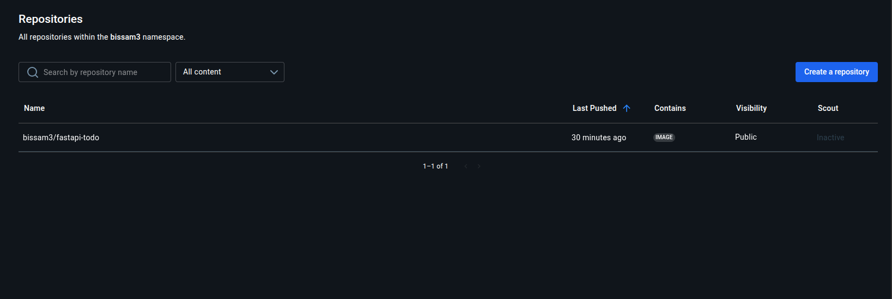
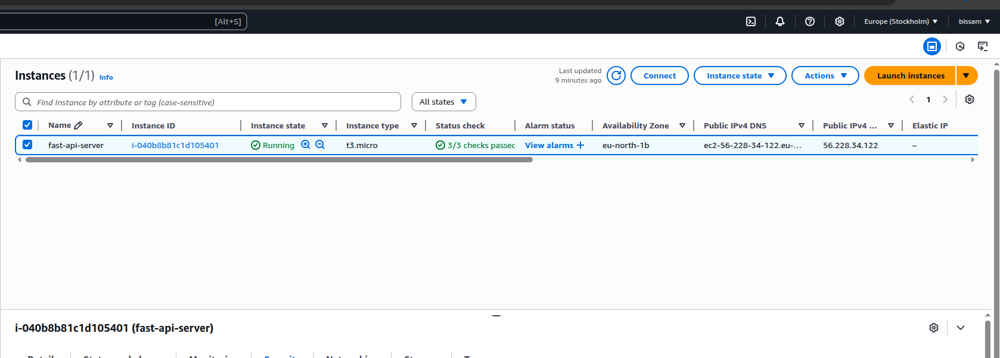

# 📝 FastAPI Todo API – CI/CD Deployed 🚀

A simple and powerful REST API built with **FastAPI**, Dockerized, and deployed via **CI/CD pipeline** using GitHub Actions on an AWS EC2 instance.

---

## 🧩 Features

- CRUD API with FastAPI
- Minimal HTML frontend (test)
- Dockerized with `Dockerfile`
- Automated build & push to Docker Hub
- CI/CD pipeline via GitHub Actions
- SSH deploy to EC2 instance

---

## 📂 Project Structure

- `main.py` – FastAPI backend  
- `test.html` – Frontend using Fetch API  
- `.github/workflows/ci-cd.yml` – CI/CD config  
- `Dockerfile` – For image creation  
- `deployment/` – Detailed deployment guides  
- `assets/` – Screenshots of working project  

---

## 📦 Skills & Tools Used

- Python, FastAPI, Uvicorn
- Docker & Docker Hub
- GitHub Actions (CI/CD)
- SSH Remote Deploy
- AWS EC2 Ubuntu Server

---

## 📸 Highlights

### ✅ GitHub CI/CD Action


### ✅ Docker Image on Docker Hub


### ✅ EC2 Instance Running App


### ✅ API in Browser


---

## 📘 Deployment Steps

Want to run this yourself? Choose your preferred deployment path:

- 🐳 [Docker + CI/CD →](deployment/ci-cd-github.md)
- 🧭 [Manual AWS EC2 Setup →](deployment/aws-deploy.md)

---

## 🔧 Run Locally

```bash
# 1. Install deps
pip install fastapi uvicorn

# 2. Run the API
uvicorn main:app --reload
```

Visit:
- API: [http://localhost:8000/todos](http://localhost:8000/todos)  
- Docs: [http://localhost:8000/docs](http://localhost:8000/docs)

---

## 🧪 Minimal Frontend (`test.html`)

```html
<script>
fetch("http://localhost:8000/todos")
  .then(res => res.json())
  .then(data => console.log(data));
</script>
```

---

## 👤 Author

[Bissam Iftikhar](https://github.com/bissamiftikhar)