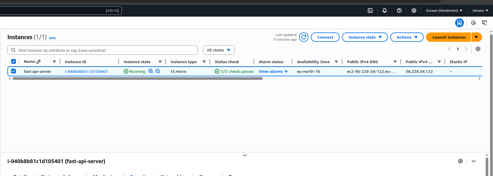
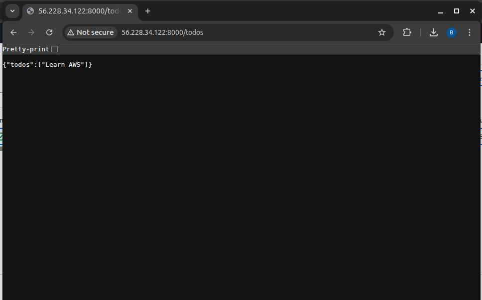

# 🛰️ FastAPI on AWS EC2

How this project was deployed on an Ubuntu EC2 instance.

---

## ✅ Setup Steps

```bash
# 1. Launch EC2 (Ubuntu 22.04)
# 2. Open ports: 22 (SSH), 8000 (API)
# 3. SSH into instance
ssh -i your-key.pem ubuntu@your-public-ip

# 4. Install Python & Git
sudo apt update && sudo apt install python3-pip git -y

# 5. Clone repo & enter folder
git clone https://github.com/your/repo.git
cd repo

# 6. Create virtual env & install deps
python3 -m venv venv
source venv/bin/activate
pip install fastapi uvicorn

# 7. Start the API
uvicorn main:app --host 0.0.0.0 --port 8000
```

Visit: `http://<your-public-ip>:8000`

---


## 📸 Screenshots

### ✅ EC2 Instance Running  


### ✅ /todos Endpoint in Browser  



---

## 🔁 Keep API Running (Optional)

### Using `screen`

```bash
sudo apt install screen
screen -S fastapi
uvicorn main:app --host 0.0.0.0 --port 8000
```

Press `Ctrl+A` then `D` to detach.

---

## 🧼 Stop Charges

Don't forget to **stop EC2** from AWS console after testing.