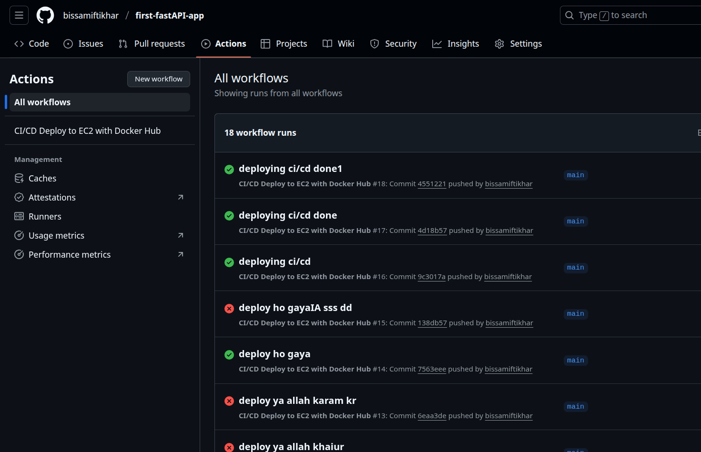

# ⚙️ CI/CD Pipeline with GitHub Actions

This app is deployed using GitHub Actions, Docker Hub, and SSH to EC2.

---

## 🔁 Workflow Summary

1. **Push to `main` branch**
2. GitHub builds Docker image from `Dockerfile`
3. Docker image is pushed to Docker Hub
4. EC2 pulls image, stops old container, and runs the new one

---

## 📄 .github/workflows/ci-cd.yml

```yaml
name: CI/CD Deploy to EC2 with Docker Hub

on:
  push:
    branches:
      - main

jobs:
  deploy:
    runs-on: ubuntu-latest

    steps:
    - name: Checkout code
      uses: actions/checkout@v3

    - name: Log in to Docker Hub
      uses: docker/login-action@v3
      with:
        username: ${{ secrets.DOCKERHUB_USERNAME }}
        password: ${{ secrets.DOCKERHUB_TOKEN }}

    - name: Build and push Docker image
      run: |
        docker build -t ${{ secrets.DOCKERHUB_USERNAME }}/fastapi-todo:v1 .
        docker push ${{ secrets.DOCKERHUB_USERNAME }}/fastapi-todo:v1

    - name: Deploy on EC2 via SSH
      uses: appleboy/ssh-action@master
      with:
        host: ${{ secrets.EC2_HOST }}
        username: ${{ secrets.EC2_USER }}
        key: ${{ secrets.EC2_SSH_KEY }}
        script: |
          docker stop todo-app || true
          docker rm todo-app || true
          docker pull ${{ secrets.DOCKERHUB_USERNAME }}/fastapi-todo:v1
          docker run -d -p 80:80 --name todo-app ${{ secrets.DOCKERHUB_USERNAME }}/fastapi-todo:v1
```

---

## 🔐 Required GitHub Secrets

- `DOCKERHUB_USERNAME`
- `DOCKERHUB_TOKEN`
- `EC2_HOST` *(Public IP or DNS)*
- `EC2_USER` *(e.g., `ubuntu`)*
- `EC2_SSH_KEY` *(Private key)*

---

## 📸 Screenshot

