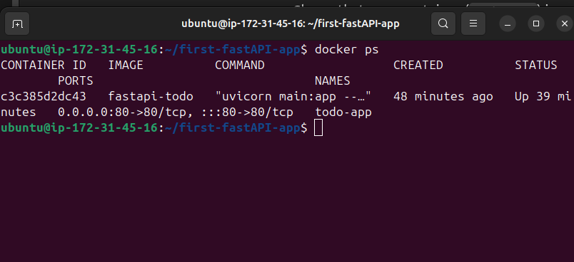
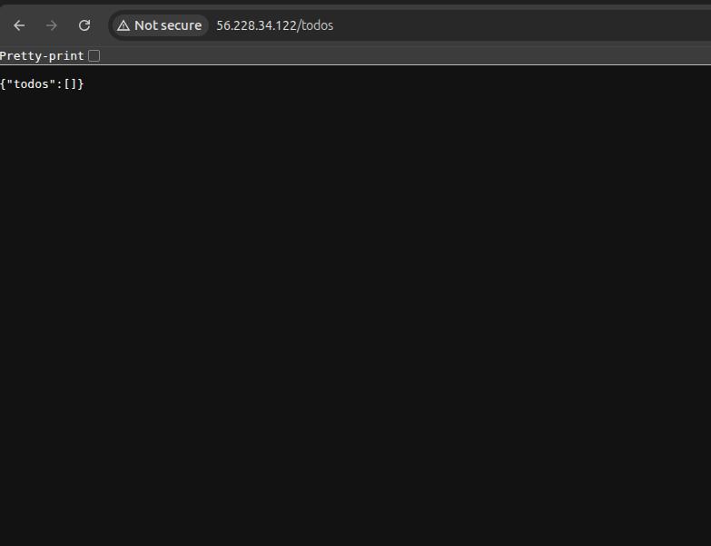

# 🐳 Dockerize FastAPI App

Steps to build and run this FastAPI app using Docker.

---

## 📄 Dockerfile

```dockerfile
FROM python:3.9-slim

WORKDIR /app
COPY . .

RUN pip install --no-cache-dir fastapi uvicorn

CMD ["uvicorn", "main:app", "--host", "0.0.0.0", "--port", "80"]
```

---

## 🔧 Build & Run

```bash
# Build Docker image
docker build -t fastapi-todo .

# Run the container
docker run -d -p 80:80 --name todo-app fastapi-todo
```

Visit: [http://localhost](http://localhost)

---

## 📸 Screenshots

  
